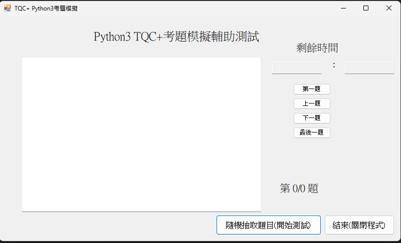
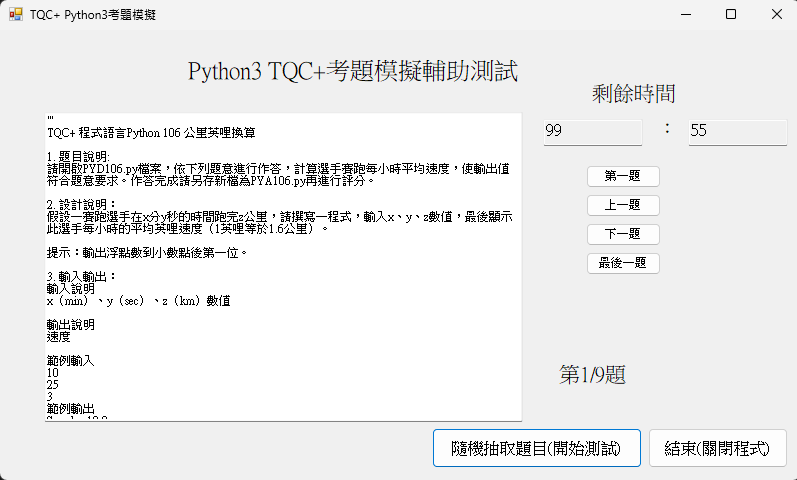

# TQC_python_test
---
<<<<<<< HEAD
# 程式說明
基於C#所製作的模擬練習程式
測試規格:TQC-Python3 共九題 100分鐘
---
如何使用
將Relese中的Bata v0.0.1下載並置於資料夾內運行即可
將Relese中的Bata v0.0.1下載並置於資料夾內運行即可
---
##　功能說明
### 主畫面

### 開始畫面

剩餘時間:計時器
題目順序按鈕：調整題目說明
左側文字：題目說明
結束：安全關閉程式
隨機抽取題目：從1-9類中隨機抽取一題並開始計時100min
## 題庫
目前題庫內有
### TQC-Python&Python3
- 基礎程式設計
- 選擇敘述
- 迴圈敘述
- 進階控制流程
- 函式(Function)
- 串列的運作(一維(list),二維及多維)
- 數組(Tuple),集合(Set),辭典(Dictionary)
- 字串(String)的運作
- 檔案與異常處理
=======
#Ver:Bata v1.0
離線測試計時程式
>>>>>>> 187251962126cf5ba2feaf334eddd514995db5a1
